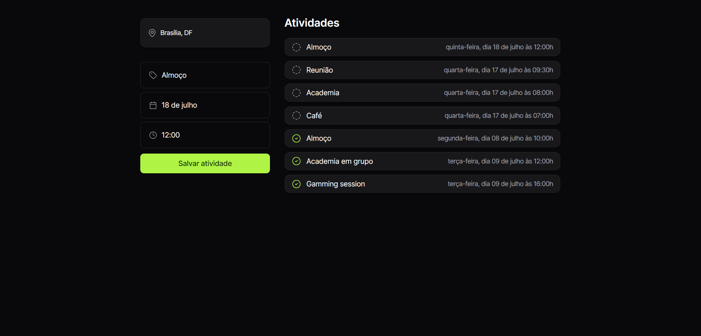

<h1 align="center"> Roteiro de Viagem </h1>

  <a href="#-tecnologias">Tecnologias</a>&nbsp;&nbsp;&nbsp;|&nbsp;&nbsp;&nbsp;
  <a href="#-projeto">Projeto</a>&nbsp;&nbsp;&nbsp;|&nbsp;&nbsp;&nbsp;

 

  

## 🚀 Tecnologias

Esse projeto foi desenvolvido com as seguintes tecnologias:

- HTML 
- CSS
- JavaScript
- Git e Github

## 💻 Projeto

Projeto voltado para simplificar o roteiro de viagem. Podemos adicionar a atividade com data e horas, e após a conclusão da atividade, temos a funcionalidade de marcar atividade concluída.
 
- [Acesse o projeto finalizado, online](https://vivianearj.github.io/Lading-Page/)
